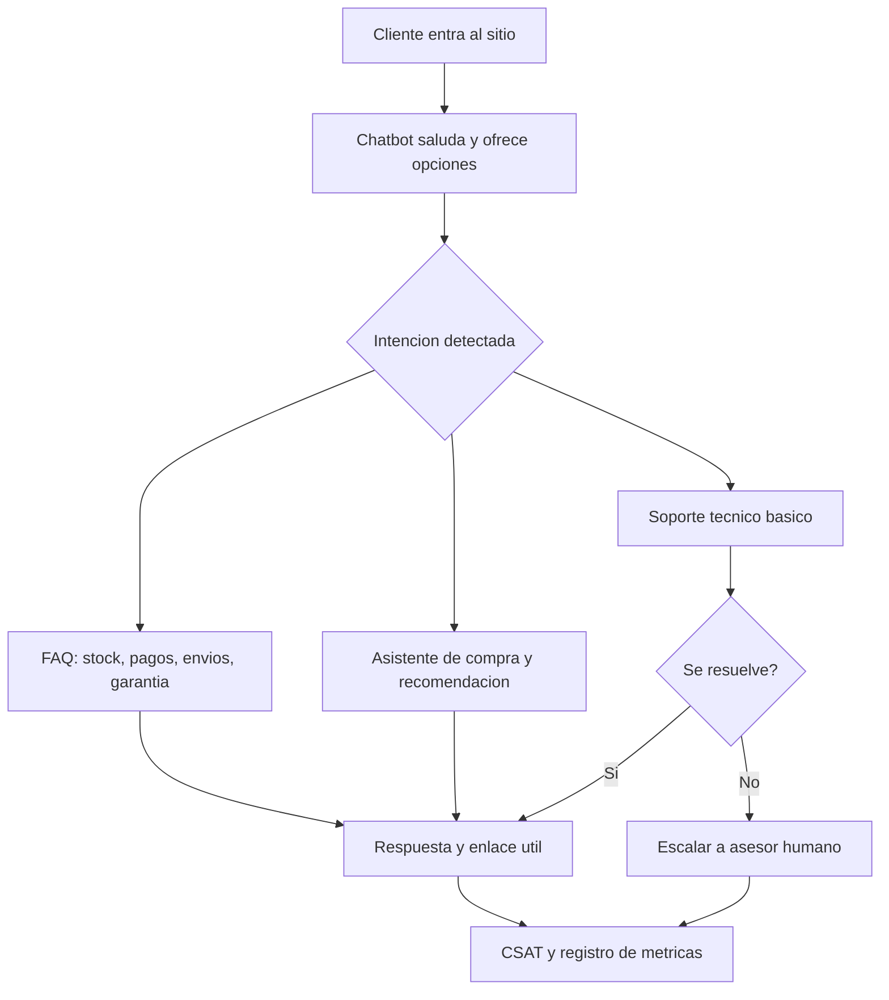
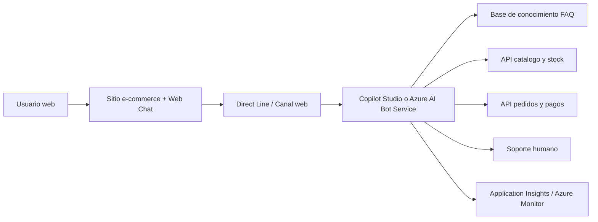

# Propuesta de solucion: Chatbot para InnovVentas

## Plan de trabajo

1. Analizar el caso practico y detectar problemas del flujo e-commerce.
2. Levantar preguntas frecuentes e intenciones principales.
3. Disenar el mapa conversacional del chatbot.
4. Seleccionar plataformas Azure y justificar la arquitectura.
5. Definir implementacion, seguridad, metricas y mejora continua.
6. Preparar el entregable final en formato Word.

## Respuestas a preguntas guia

### Pregunta 01: ¿Cuales son las preguntas frecuentes mas comunes que enfrentan los clientes al usar el sitio web de InnovVentas?

Las consultas mas frecuentes se concentran en disponibilidad de stock, especificaciones tecnicas, metodos de pago, tiempos de envio, garantias, cambios/devoluciones, seguimiento de pedidos y soporte tecnico basico. Tambien aparecen preguntas comparativas como 'que laptop me conviene para estudiar' o 'que celular tiene mejor bateria'. Estas consultas deben priorizarse porque ocurren justo antes de agregar al carrito o completar el pago, momento donde la falta de respuesta inmediata genera abandono.

### Pregunta 02: ¿Que herramientas o plataformas son mas adecuadas para desarrollar e integrar el chatbot al sitio web?

La solucion recomendada es Microsoft Copilot Studio para construir el agente con bajo codigo, temas guiados, respuestas generativas basadas en fuentes de conocimiento y conexion con acciones. Para una integracion web mas personalizada se propone Azure AI Bot Service con Bot Framework Web Chat y canal Direct Line. Application Insights/Azure Monitor permitira registrar disponibilidad, uso, errores e interacciones del bot. Esta combinacion aprovecha servicios Azure, reduce tiempo de implementacion y permite evolucionar desde FAQ hacia asistencia transaccional.

### Pregunta 03: ¿Como se puede evaluar la efectividad del chatbot en terminos de satisfaccion del cliente y aumento de ventas?

La efectividad debe medirse comparando una linea base previa contra indicadores posteriores a la implementacion. Para satisfaccion: CSAT al cierre de la conversacion, porcentaje de conversaciones resueltas sin agente humano, tiempo medio de respuesta y tasa de escalamiento. Para ventas: conversion de usuarios que interactuaron con el chatbot, reduccion de carritos abandonados, productos agregados al carrito luego de una recomendacion y valor promedio de pedido. Se recomienda revisar resultados semanalmente durante el piloto y mensualmente en produccion.

### Pregunta 04: ¿Que desafios tecnicos podrian surgir durante la implementacion del chatbot y como podrian resolverse?

Los principales desafios son mantener actualizado el catalogo, proteger datos personales, integrar el bot con sistemas de stock/pedidos, evitar respuestas imprecisas y medir correctamente el impacto comercial. Para resolverlos se propone conectar el bot a APIs o base de datos de productos, aplicar autenticacion solo cuando sea necesaria, definir temas criticos con respuestas controladas, usar fuentes de conocimiento verificadas, activar escalamiento a soporte humano y monitorear errores con Application Insights.

### Pregunta 05: ¿Que metricas deben monitorearse para asegurar el exito del chatbot y como se pueden optimizar sus funcionalidades?

Deben monitorearse sesiones iniciadas, intenciones mas consultadas, tasa de resolucion, preguntas sin respuesta, tiempo medio de respuesta, CSAT, escalamiento, errores tecnicos, conversion asistida, abandono de carrito y ventas atribuidas. La optimizacion se realiza revisando transcripciones, creando nuevos temas para preguntas recurrentes, mejorando la base de conocimiento, ajustando mensajes de recomendacion, probando variantes de flujos y priorizando las intenciones con mayor impacto en conversion.

## Propuesta tecnica

### 1. Necesidad del cliente y problema identificado

InnovVentas pierde oportunidades de venta porque el sitio web no responde de forma inmediata dudas que aparecen durante la decision de compra. El problema afecta tres puntos del flujo e-commerce: exploracion de productos, confirmacion de condiciones de compra y soporte posterior.

La propuesta consiste en implementar un chatbot integrado al sitio web, disponible 24/7, capaz de resolver preguntas frecuentes, guiar la seleccion de productos, reducir friccion en checkout y derivar a soporte humano cuando la consulta supere el alcance automatizado.

### 2. Alcance funcional del chatbot

Atendera preguntas frecuentes sobre stock, especificaciones, pagos, envios, garantias y devoluciones.

Recomendara productos segun categoria, presupuesto, uso previsto y caracteristicas relevantes.

Acompanara el proceso de compra con enlaces a producto, carrito, medios de pago y seguimiento de pedido.

Ofrecera soporte tecnico basico y escalara a un asesor cuando detecte reclamos, fallas complejas o baja satisfaccion.

### 3. Plataforma seleccionada

Se recomienda Microsoft Copilot Studio como plataforma principal por su enfoque de bajo codigo, capacidad de crear agentes, configurar temas, usar conocimiento corporativo y publicar el agente en canales web. Para un sitio con necesidades de mayor personalizacion visual o control del front-end, se complementa con Azure AI Bot Service, Bot Framework Web Chat y Direct Line.

Application Insights/Azure Monitor se usara para telemetria, diagnostico y analisis de uso. Las fuentes oficiales de Microsoft indican que Web Chat puede integrarse en sitios web mediante JavaScript o React y que Application Insights permite visualizar disponibilidad, rendimiento y uso del bot.

### 4. Plan de implementacion

Fase 1 - Diagnostico: analizar transcripciones, formularios, busquedas internas y consultas de ventas para construir una matriz de preguntas frecuentes.

Fase 2 - Diseno: definir intenciones, entidades, respuestas, politicas de escalamiento y tono de comunicacion.

Fase 3 - Construccion: crear el agente en Copilot Studio, cargar fuentes de conocimiento, configurar temas y acciones con APIs de catalogo/pedidos.

Fase 4 - Integracion: publicar el chatbot en el sitio web con Web Chat/Direct Line o canal web de Copilot Studio, respetando identidad visual y accesibilidad.

Fase 5 - Pruebas: validar respuestas, casos limite, seguridad, privacidad, tiempos de respuesta y trazabilidad de eventos.

Fase 6 - Piloto y mejora: desplegar a un porcentaje de usuarios, medir metricas y optimizar temas antes del despliegue total.

### 5. Seguridad, calidad y medio ambiente

Seguridad: minimizar datos personales, evitar exponer claves de Direct Line en el cliente, usar tokens generados por backend, aplicar HTTPS, control de acceso y retencion responsable de transcripciones.

Calidad: probar preguntas frecuentes, variantes de lenguaje, disponibilidad de integraciones, respuestas sin informacion suficiente y experiencia movil.

Medio ambiente: usar servicios cloud escalables bajo demanda, evitar infraestructura sobredimensionada y reutilizar documentacion digital para capacitacion y mejora continua.

### 6. Indicadores de exito

Reducir en al menos 15% el abandono de carrito durante los primeros tres meses.

Resolver automaticamente al menos 60% de preguntas frecuentes del sitio.

Mantener CSAT igual o superior a 4/5 en conversaciones cerradas.

Detectar semanalmente nuevas preguntas sin respuesta y convertirlas en mejoras del flujo.

## Mapa conversacional

## Arquitectura propuesta

## Fuentes

- [Microsoft Copilot Studio documentation](https://learn.microsoft.com/en-us/microsoft-copilot-studio/)
- [Explore AI capabilities in Copilot Studio](https://learn.microsoft.com/en-us/microsoft-copilot-studio/guidance/ai-capabilities)
- [Web Chat overview - Azure AI Bot Service](https://learn.microsoft.com/en-us/azure/bot-service/bot-builder-webchat-overview?view=azure-bot-service-4.0)
- [About Direct Line - Azure Bot Service](https://learn.microsoft.com/en-gb/azure/bot-service/bot-service-channel-directline?view=azure-bot-service-4.0)
- [Add telemetry to your bot - Azure Bot Service](https://learn.microsoft.com/en-us/azure/bot-service/bot-builder-telemetry?view=azure-bot-service-4.0)
